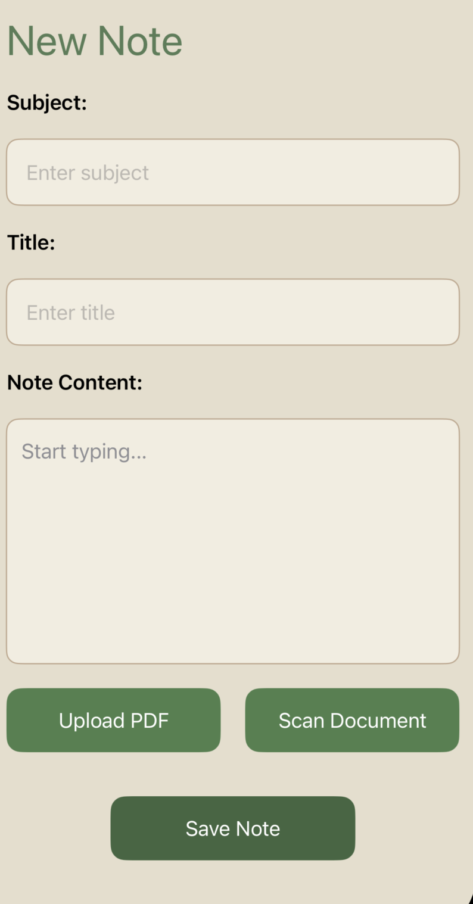

# class notes app
a simple note-taking app built with SwiftUI, allowing users to upload, browse, and manage notes.

## screenshots 🖼️

## run project
1. clone the repository: https://github.com/dmunagapati/ClassNotesApp
2. open `classnotesapp.xcodeproj` in Xcode.
3. build and run the project on the simulator or your device.

## technologies used
- swift
- swiftUI
- github for version control

## Contact
reach out to me on https://www.linkedin.com/in/deepthimunagapati/
